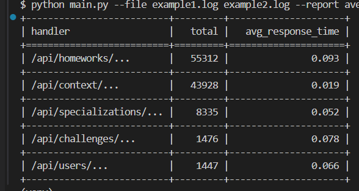

# Скрипт для составления отчетов и анализа логов
 
## Быстрый старт:
- клонировать гит
```
git clone https://github.com/Wiltort/log-parser.git
cd log-parser
```
- установить зависимости
```
pip install -r requirements.txt
```
- запустить с параметрами
```bash
python main.py --file example1.log example2.log --report average
```

- запуск тестов
```bash
python -m pytest
```
- так же можно указывать необязательный параметр даты
```bash
python main.py --file example1.log example2.log --report average --date 2025-22-06
```